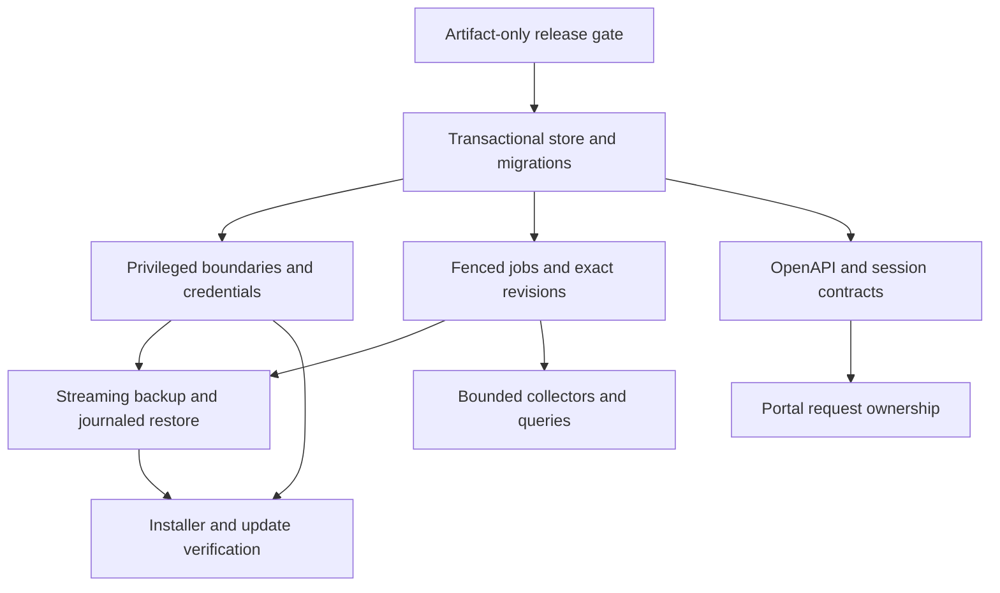
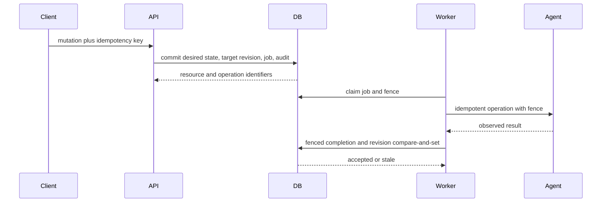
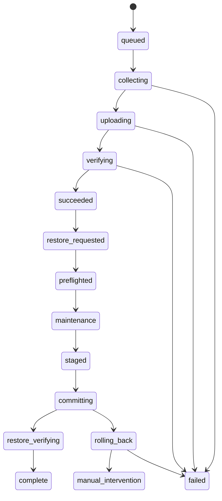
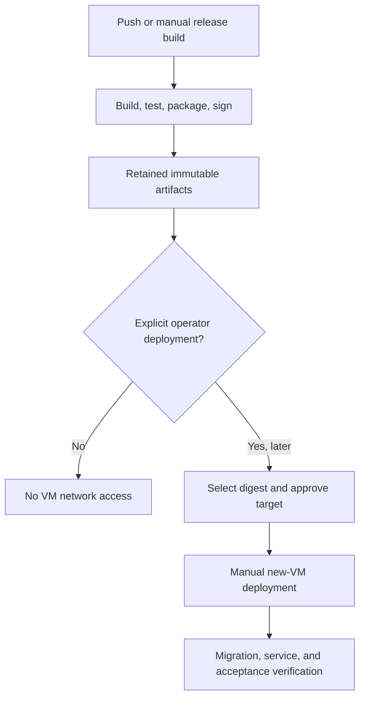

# Kelmor Production Remediation - Plan

## Goal Capsule

- **Objective:** Close every validated Kelmor review finding without expanding the product beyond its stated hosting-platform scope.
- **Authority:** Product requirements in this plan override implementation preferences. Security and data-integrity requirements override compatibility convenience.
- **Execution profile:** Land dependency-ordered units with focused tests before broad verification.
- **Stop conditions:** Stop if a migration can grant ambiguous privileges, a stale worker can still mutate host state, an HPM1 backup cannot be restored, or CI can contact the current VM.
- **Tail ownership:** Finish with local release artifacts and a manual deployment checklist. Deployment to the new VM is an operator-owned follow-up.

---

## Product Contract

### Summary

This plan repairs Kelmor's production safety, convergence, backup integrity, release contracts, API parity, portal state handling, and host-scale behavior.
Normal CI and `main` pushes will build and retain signed artifacts without publishing to a VM.
The repaired release will be deployed and validated manually on a new Ubuntu 24.04 VM.

### Problem Frame

The repository implements the first production slice of Kelmor, but the audit found direct cross-tenant trust-boundary failures and many paths that can report success after partial or failed work.
The same review found incomplete release artifacts, unsafe migration behavior, stale portal state, unbounded host operations, and gaps between the OpenAPI contract and shipped handlers.

The current validation VM is unavailable.
Implementation must not depend on it or contact it.
Local, PostgreSQL-backed, packaging, and simulated-host evidence must carry the remediation until an operator deploys the immutable release artifact to a new VM.

### Actors

- A1. **Kelmor operator:** installs, upgrades, monitors, backs up, restores, and manages the host.
- A2. **Tenant:** manages only resources inside the tenant account boundary.
- A3. **Release operator:** builds and signs artifacts, then manually approves publication or deployment.
- A4. **Kelmor worker:** reconciles desired state through fenced jobs and the typed privileged agent.

### Requirements

#### Release isolation and verification

- R1. Normal pushes and release builds must not contact, upload to, or deploy onto any VM.
- R2. Release builds must still produce, sign, validate, and retain immutable Debian and update-feed artifacts for later manual deployment.
- R3. The repository must use one supported Go baseline and every documented test target must execute successfully.
- R4. Code remediation completes with local and CI evidence, while production acceptance remains blocked on a separate manual pre-traffic gate for the exact artifact on a new disposable Ubuntu 24.04 VM.

#### Privileged boundaries and credentials

- R5. The agent must map immutable account identity to a root-owned canonical directory, resolve every filesystem operation from its trusted descriptor, and fail closed when required no-symlink kernel guarantees are unavailable.
- R6. Website domains and document roots must remain bound to the owning account at the API, database, worker, agent, and generated Nginx boundaries.
- R7. Fresh installs and upgrades must generate, activate, rotate, and revoke unique administrator and PowerDNS credentials without exposing values through process arguments, logs, jobs, backups, or evidence, and tenant processes must be unable to reach the PowerDNS management listener.
- R8. Mail credential maps and native exports must not expose reusable password material to tenants or read-only auditors.

#### Desired state and jobs

- R9. Every asynchronous desired-state mutation must atomically commit the resource state, target revision, durable job, idempotency result, and audit event.
- R10. Job claims, heartbeats, retries, progress, cancellation, completion, and privileged effects must use an agent-verified resource fence so stale workers cannot begin, repeat, or acknowledge host mutations.
- R11. Each reconcile job must apply one immutable target revision and must never acknowledge a newer desired revision.
- R12. Imports, application retirement, DKIM publication, mailbox bootstrap, and backup metadata must converge after retry or restart without silent partial success.

#### Backup and restore

- R13. A backup may succeed only when every expected home, database, and mailbox component is captured under one declared consistency boundary, appears exactly once, and passes archive and repository checksums.
- R14. New backups must use bounded-memory streaming while preserving read compatibility for existing HPM1 backups.
- R15. Object upload and metadata state must converge through stable object identifiers, resumable verification, and cleanup of expired partial objects.
- R16. Restore must bind actor, account, object, manifest, format, and key identities in an immutable journal, then hold an account-wide write fence through maintenance, staging, validation, component checkpoints, rollback, and deterministic recovery.
- R17. Chunked file uploads must enforce quota against the projected final state without double-counting staging bytes.

#### Installation, migration, and updates

- R18. One dedicated database connection must serialize migration discovery and application, and migrations must use expand/backfill/validate/contract sequencing while the prior supported binary remains compatible.
- R19. Ambiguous reseller privilege rows must fail closed, certificate deduplication must preserve active jobs, and account/domain/package constraints must match application ownership rules.
- R20. Installer state writes and required service activation checks must be durable failure barriers.
- R21. One release version and one runtime-asset inventory must drive binaries, aliases, installer, units, templates, migrations, portals, backups, packaging, and the signed feed.

#### API and portals

- R22. OpenAPI must describe effective authentication, server URLs, registered routes, request bodies, response statuses, and capability metadata.
- R23. Session refresh must rotate or renew an authenticated session instead of accepting login credentials as a refresh substitute.
- R24. Portal requests and mutations must commit state only for the immutable account, route, resource, filter, and request generation that started them.
- R25. Restore and password-change submissions must be server-safe and UI-guarded against duplicate concurrent execution.
- R26. The Control portal must have behavior tests for session, authorization, account scoping, mutations, polling, and stale responses.

#### Host-scale behavior

- R27. Usage and quota enforcement must run independently of desired-state drift and expose sample freshness to monitor clients.
- R28. Account, DNS, certificate, mail-map, audit, directory, and backup list work must use bounded batches, stable cursors, indexed access, or bulk snapshots.
- R29. Backup, object-store, and monitoring memory and I/O must remain bounded by configured limits rather than tenant data size.

### Key Flows

- F1. **Artifact-only release:** A3 triggers or receives a release build, verifies signatures and inventories, downloads an immutable artifact, and no network operation targets a VM.
- F2. **Desired-state mutation:** A1 or A2 submits a mutation, one database transaction records intent and work, A4 claims it with a fence, the agent applies an idempotent effect, and only the matching owner acknowledges the target revision.
- F3. **Backup:** A1 or A2 starts a backup, the worker inventories expected components, streams and authenticates them, verifies the object, and atomically marks metadata successful.
- F4. **Restore:** A1 or A2 requests an account-owned backup, the worker enters maintenance, stages and verifies all data, journals each component switch, verifies the result, and either completes or remains safely recoverable.
- F5. **Portal navigation:** A1 or A2 changes account, route, path, or filter while a request is pending, and stale results cannot update or mutate the new context.
- F6. **Manual deployment:** A3 selects a signed artifact by digest, deploys it to a new VM, runs migration and service checks in the documented order, and records go/no-go evidence.

### Acceptance Examples

- AE1. A push to `main` completes release artifact production with VM secrets configured, but no `ssh`, `scp`, `rsync`, or VM publish script runs.
- AE2. A tenant creates a parent or final symlink to a host path and invokes every managed-file operation; the request fails and no outside inode changes.
- AE3. Worker A loses its lease, worker B completes the job, and resumed worker A cannot heartbeat, mutate the resource through the agent, or mark the job successful.
- AE4. PostgreSQL fails after desired-state validation but before job publication; no resource, job, idempotency result, or success audit is committed.
- AE5. A backup encounters one unreadable mailbox; the backup fails and no successful manifest or restorable object is published.
- AE6. Restore crashes after switching one component; restart resumes the journal deterministically or leaves the account in maintenance with operator-visible intervention state.
- AE7. An operator switches accounts before a file read returns; the stale editor cannot save content into the newly selected account.
- AE8. A generated OpenAPI client authenticates protected operations, reaches root health endpoints, and can call every shipped file, service, database, and cron operation with the documented body and status.

### Success Criteria

- No validated P0 or P1 finding remains reproducible in focused tests.
- Each moderate contract, configuration, race, quota, checksum, or migration finding has a regression test.
- CI proves that artifact-only release mode cannot initiate VM network operations.
- `make lint`, Go tests, both portal test suites, builds, packaging, signature validation, and release inventory checks pass without a VM.
- The manual deployment runbook names the immutable artifact, pre-deploy SQL, service order, rollback boundary, and post-deploy evidence.

### Scope Boundaries

#### In scope

- All validated findings numbered `#1` through `#71` in the audit, excluding numbers rejected or demoted by validation as recorded in the Finding Coverage appendix.
- Focused structural changes required to make persistence, jobs, privileged files, backups, restore, migration, release, API, and portal behavior enforceable.
- Documentation and runbook updates needed to operate the repaired system.

#### Deferred to Follow-Up Work

- Executing the Ubuntu 24.04, QEMU, public ACME, SMTP, DNS, and reboot acceptance path on the new VM.
- Rotating or deleting secrets stored outside this repository for the unavailable VM.
- Splitting every control-plane service into a distinct Unix and PostgreSQL role beyond the credential and listener isolation required by R7.
- Product UX enhancements listed in `docs/kelmor-audit/consolidated-remaining-gaps.md` that are not represented by a validated finding in this remediation.

#### Outside this product's identity

- Billing or WHMCS, Windows hosting, Kubernetes control, and arbitrary root-shell APIs.
- Expansion of WordPress, Node, or Python product scope beyond fixing validated lifecycle defects.

---

## Planning Contract

### Key Technical Decisions

- KTD1. **Artifact-only CI by default.** `(session-settled: user-directed — chosen over automatic VM upload: the current VM is unavailable and deployment will occur manually on a new machine.)` The release workflow builds and uploads artifacts on normal pushes. VM publication exists only as an explicit manual action.
- KTD2. **Descriptor-rooted privileged filesystem.** Extract the proven `internal/update/securefs.go` pattern into a neutral lower-level package used by updater, agent, backup, and restore code. The agent derives a canonical account root from trusted account identity and opens it without a worker-supplied absolute path. Required `openat2` guarantees fail closed rather than falling back to validate-then-`os.*` behavior. This follows the Linux containment model in [openat2(2)](https://man7.org/linux/man-pages/man2/openat2.2.html).
- KTD3. **PostgreSQL jobs are the transactional outbox.** Desired state, job, target revision, idempotency result, and audit event commit together. Notifications may wake workers but never replace durable polling.
- KTD4. **Leases use monotonic resource fencing.** Claims return an owner, operation identity, and non-reusable fence. Every database transition and irreversible agent effect checks that fence against agent-owned durable resource state immediately before mutation. Zero affected rows or an older agent fence terminates the attempt. `FOR UPDATE SKIP LOCKED` selects work but does not provide fencing by itself, consistent with [PostgreSQL row locking](https://www.postgresql.org/docs/current/sql-select.html).
- KTD5. **New backups use a versioned streaming envelope.** Preserve read-only HPM1 compatibility. Write new backups with the current stable reviewed streaming AEAD library, per-backup data keys, authenticated key identifiers and metadata, bounded frames, plaintext component hashes, and a ciphertext object hash. Key rotation must preserve restore access for every retained backup. Do not construct a custom chunked AES-GCM protocol.
- KTD6. **Restore uses an account-wide fence and journaled recovery.** Filesystems, PostgreSQL, MariaDB, Maildir, web workloads, FTP, mail delivery, cron, queued jobs, and stale workers cannot share one atomic transaction. Restore drains or fences every writer, pins immutable source identities, checkpoints probeable external effects, and prefers deterministic roll-forward. A failed rollback retains all recovery artifacts, maintenance mode, and `manual_intervention`.
- KTD7. **Corrective migrations are forward-only artifacts.** Do not edit applied migration files. Hold one session advisory lock on a dedicated connection across discovery and the full ordered loop, while each supported migration uses its own transaction. Use a fixed lock order, bounded deadlock/serialization retry, expand/backfill/validate/contract sequencing, and lock/statement timeouts. Nontransactional work requires an explicit resumable state. `NOT VALID` constraints protect new writes before later validation as described by [PostgreSQL ALTER TABLE](https://www.postgresql.org/docs/current/sql-altertable.html).
- KTD8. **Intentional operation contracts are authoritative.** Record the intended handler behavior in a reviewed decision table, repair handlers and OpenAPI against that table, then add route and schema parity gates so neither side can drift silently.
- KTD9. **Portal state commits require an immutable context key.** Abort requests when possible and also check request generation before committing data, errors, selection, notices, or loading state. This follows [React effect cleanup](https://react.dev/learn/synchronizing-with-effects) and [React Router race handling](https://reactrouter.com/7.8.0/explanation/race-conditions).
- KTD10. **Scale work returns bounded and freshness-aware contracts.** Replace exact totals and unbounded lists where they require full scans. Monitor responses identify sample age instead of collecting synchronously.
- KTD11. **Operation contracts precede bulk handler conversion.** Define intentional mutation, replay, cancellation, and operation-result behavior before replacing persistence calls. Handler behavior remains authoritative only after this decision table excludes known accidental behavior.
- KTD12. **PowerDNS uses identity-based local network isolation.** Enforce IPv4 and IPv6 output filtering that permits only the trusted service identity and root to reach the loopback management port. Service activation fails if a real tenant UID can reach any local management route.
- KTD13. **Privileged commands use fixed execution contracts.** Agent operations select allowlisted executables, validated argument schemas, fixed minimal environments, rooted working directories, bounded output, and no shell interpretation. Leading-option and control-character inputs fail before process creation.
- KTD14. **Backup consistency is explicit.** Acquire an account backup fence, quiesce writers needed for the selected consistency level, and authenticate consistency anchors in the manifest. A complete set of individually valid components is not treated as a coherent backup without those anchors.

### High-Level Technical Design

#### Dependency graph

#### Desired-state and job sequence

#### Backup and restore states

#### Release and deployment boundary

### System-Wide Impact

- **Data lifecycle:** New outbox, idempotency, lease, restore-journal, and collector state require additive migrations and upgrade fixtures.
- **Authorization:** Export capabilities, website ownership, PowerDNS reachability, and credential file ownership affect role and live-host tests.
- **Compatibility:** Existing HPM1 backups remain readable. Existing API clients retain intended handler behavior except where the documented refresh contract replaces the broken login alias.
- **Operations:** Release publication becomes manual. Existing hosts receive no new feed until an operator publishes an immutable artifact.
- **Performance:** Monitoring changes from synchronous measurement to persisted samples. Clients must handle freshness metadata.
- **Trust boundary:** The agent, not the worker payload, owns account-root resolution and resource-fence authority.
- **Availability:** Backup and restore introduce bounded account-level quiescence. API and data-plane writers must surface maintenance rather than bypass it.

### Risks and Dependencies

- Streaming encryption introduces a format, key lifecycle, and dependency commitment. Pin the current stable reviewed library, retain golden fixtures for every readable version, authenticate key identifiers, and verify rotation before retiring a key.
- Fencing at the database alone cannot stop a stale external side effect. The agent must persist resource-scoped fences and operation receipts, and uncertain outcomes must reconcile observed state before retry.
- Reseller privilege provenance may be unavailable. Ambiguous rows must remain deny-all until an operator supplies an allowlist.
- Restore rollback needs capacity for snapshots and staging. Preflight must reject a restore that cannot preserve the last known-good state, and cleanup cannot remove recovery material before verified completion.
- Runtime migration rollback is limited. New schema must remain compatible with the immediately prior binary until manual deployment verification closes.
- PostgreSQL server support is inconsistent across local CI and release documentation. This remediation uses behavior supported by the tested PostgreSQL service and records broader version reconciliation as follow-up unless implementation proves it blocks a unit.
- Transactional commands can deadlock under opposing mutations. All commands must use one lock order, bounded retries for serialization/deadlock errors, and an idempotency lookup after ambiguous outcomes.
- Simulated tests cannot prove the P0 kernel, systemd, socket, and local-network boundaries. The exact signed artifact remains blocked from production traffic until the new-VM pre-activation exploit suite passes.

### Phased Delivery

1. Establish artifact-only release safety and a working toolchain.
2. Land additive schema, transactional persistence, and fencing primitives.
3. Close privileged boundaries and production credential bootstrap.
4. Convert worker and host lifecycle operations.
5. Replace backup and restore integrity paths.
6. Repair installer, updater, API, portal, and scale contracts.
7. Run broad local verification and produce the immutable release plus manual deployment evidence package.

---

## Implementation Units

### U1. Disable automatic VM publishing and repair the build baseline

- **Goal:** Guarantee that implementation and normal releases cannot contact the current VM while preserving signed artifacts.
- **Requirements:** R1-R4, R21.
- **Dependencies:** None.
- **Files:**
  - `.github/workflows/release.yml`
  - `.github/workflows/ci.yml`
  - `scripts/ci/publish-update-feed.sh`
  - `scripts/ci/publish-update-feed_test.sh`
  - `scripts/ci/release.sh`
  - `Makefile`
  - `go.mod`
  - `release-manifest.yaml`
  - `docs/upgrade.md`
  - Tests in `scripts/ci/publish-update-feed_test.sh` and release validation scripts
- **Approach:**
  1. Make normal pushes artifact-only and require explicit manual dispatch plus approval for any publish operation.
  2. Default the publish input to false and ensure the publish step cannot run on `push`.
  3. Keep Debian, update-feed, release metadata, and signature artifacts unchanged.
  4. Align CI and release builds to Go 1.23 and add a manifest/module consistency check.
  5. Repair `test-provisioning` to reference existing packages and execute it in CI.
  6. Keep QEMU and VM scripts available for the later new-VM operation, but do not invoke them in this plan's automated verification.
- **Patterns to follow:** Existing artifact upload step in `.github/workflows/release.yml`; fail-closed shell assertions in `scripts/ci`.
- **Test scenarios:**
  - A `push` event with every VM secret present does not invoke `ssh`, `scp`, `rsync`, or `publish-update-feed.sh`.
  - A manual dispatch with publish false retains artifacts and performs no network publication.
  - A manual dispatch with publish true enters the explicit publish path and fails closed without target approval or credentials.
  - Go version validation fails when `go.mod`, CI, release workflow, or `release-manifest.yaml` diverges.
  - `make test-provisioning` runs only existing package paths and returns the real test result.
- **Verification:** Workflow expression tests, shell publish tests, provisioning tests, and local release generation prove artifact-only behavior.

### U2. Add transactional persistence, idempotency, and corrective schema

- **Goal:** Make resource intent, jobs, audits, and upgrade state commit atomically and enforce account ownership in PostgreSQL.
- **Requirements:** R6, R9, R12, R18, R19.
- **Dependencies:** U1.
- **Files:**
  - `internal/store/store.go`
  - `internal/store/memory.go`
  - `internal/store/postgres.go`
  - `internal/store/migrate.go`
  - `internal/store/models.go`
  - `internal/httpserver/api.go`
  - `internal/migration/native.go`
  - New migrations after `db/migrations/000026_accounts_package_foreign_key.sql`
  - `internal/store/account_atomic_test.go`
  - `internal/store/postgres_test.go`
  - `internal/httpserver/api_test.go`
  - Migration upgrade fixtures under `internal/store`
- **Approach:**
  1. Define the intentional operation-result, replay, cancellation, and audit contract before changing handler persistence.
  2. Serialize the complete migration loop on one dedicated connection with one bounded session advisory lock.
  3. Define one row-lock order and bounded retry policy for deadlock and serialization failures.
  4. Add corrective migrations for duplicate package constraints, account/domain ownership, certificate-job remapping, idempotency, job fences, restore journals, and required indexes.
  5. Preserve ambiguous empty reseller privilege masks as deny-all unless an explicit operator allowlist proves legacy intent.
  6. Replace void mutators with error-returning, intent-specific transactions.
  7. Extend account transaction patterns to every asynchronous create, update, delete, import, and backup metadata path.
  8. Persist idempotency request fingerprints and prior operation results before uniqueness checks can reject a valid replay.
- **Execution note:** Start with PostgreSQL failure-injection and upgrade fixtures before changing store interfaces.
- **Patterns to follow:** `CreateAccountWithJob`, `UpdateAccountWithJob`, `RotatePasswordAndEnqueue`, and `insertJobTx`.
- **Test scenarios:**
  - Fail each statement boundary and confirm no partial resource, job, audit, or idempotency record remains.
  - Lose the response after commit and replay the same key; the original resource and operation are returned.
  - Reuse the same key with a different fingerprint; the request is rejected without mutation.
  - Start API and worker migrations concurrently; one serialized sequence applies each migration exactly once.
  - Lose the dedicated migration connection before and after each version record; restart either completes or rolls back the migration without a false marker.
  - Run opposing concurrent mutations that acquire the same resource, idempotency, job, audit, and revision rows; bounded retries return one unambiguous result.
  - Run the previous supported binary against expanded schema and the new binary against pre-contract schema; both remain safe until rollout closure.
  - Upgrade duplicate certificates with queued and running jobs; every job references the retained certificate.
  - Upgrade intentional-empty and proven-legacy reseller masks; only the allowlisted legacy rows gain privileges.
  - Insert a website with a foreign account domain; API and composite constraint both reject it.
  - Inspect package constraints after upgrade; one validated foreign key remains.
- **Verification:** Memory and PostgreSQL contract tests, concurrent migration tests, and fresh/upgrade catalog checks pass.

### U3. Close privileged filesystem and credential boundaries

- **Goal:** Eliminate direct host and cross-tenant compromise paths.
- **Requirements:** R5-R8.
- **Dependencies:** U2.
- **Files:**
  - New shared secure filesystem package under `agent`
  - `agent/policy/path.go`
  - `agent/operations/files.go`
  - `agent/operations/apply_file.go`
  - `agent/operations/archive.go`
  - `agent/operations/linux.go`
  - `agent/operations/nginx.go`
  - `internal/configuration/nginx.go`
  - `internal/httpserver/api.go`
  - `internal/app/boot.go`
  - `internal/store/seed.go`
  - `internal/rbac/rbac.go`
  - `internal/migration/native.go`
  - `agent/operations/stack.go`
  - `installer/phases/stack.go`
  - `installer/phases/units/panel-api.service`
  - `installer/phases/units/panel-worker.service`
  - `internal/firewall/rules.go`
  - Tests in the corresponding `*_test.go` files and `tests/security/idor_test.go`
- **Approach:**
  1. Extract updater secure filesystem primitives into a neutral lower-level package for updater, agent, backup, and restore use.
  2. Derive account roots from agent-owned identity records, verify root ownership and mode, and open trusted descriptors without accepting absolute roots from workers.
  3. Require no-symlink, beneath-root, and no-magic-link resolution for reads, writes, listing, rename, deletion, ownership, staging, and archive extraction; unavailable guarantees fail closed.
  4. Carry account-relative paths across API, job, and agent boundaries.
  5. Reject links, devices, duplicate archive entries, excessive expansion, and non-regular replacement targets.
  6. Validate document roots independently at API, worker, agent, and Nginx rendering boundaries.
  7. Generate administrator and PowerDNS secrets before service activation, deliver them through systemd credentials, preserve them safely on resume, and force first administrator rotation.
  8. Rotate PowerDNS through prepare, activate, verify, and revoke states; invalidate administrator sessions after mandatory rotation.
  9. Enforce identity-based IPv4 and IPv6 local output filtering for PowerDNS management and treat the random key as defense in depth.
  10. Keep mail maps service-readable rather than world-readable and enforce the existing password baseline.
  11. Add export and credential-export capabilities; omit password hashes by default and exclude auditors from both.
- **Patterns to follow:** `internal/update/securefs.go`, installer secret-file ownership patterns, and capability matrix tests.
- **Test scenarios:**
  - Final and parent symlinks, rename races, and pre-created staging links cannot escape an account root.
  - A forged account/root pair, replaced account root, magic link, and cross-filesystem mount fail before lookup or mutation.
  - A host without the required `openat2` guarantees fails the privileged operation closed.
  - Archive traversal, absolute names, links, devices, duplicate entries, and expansion bombs fail before mutation.
  - Foreign document roots and balanced Nginx directive injection fail at every trust boundary.
  - A clean install rejects the repository-known administrator password and requires rotation.
  - Interrupted PowerDNS or administrator credential rotation recovers without reviving a retired value.
  - Secrets do not appear in process arguments, environment diagnostics, logs, job responses, backups, or evidence.
  - Real tenant UIDs cannot read mail maps or reach PowerDNS management through IPv4, IPv6, or alternate local routes.
  - Auditors can inspect account metadata but cannot export mailbox or FTP hashes.
- **Verification:** Security, agent, installer, firewall, and two-account PostgreSQL tests pass; no test modifies an inode outside its temporary root.

### U4. Fence jobs and complete host-operation lifecycles

- **Goal:** Make retries, cancellation, reconciliation, and privileged effects converge under crashes and concurrency.
- **Requirements:** R10-R12.
- **Dependencies:** U2, U3.
- **Files:**
  - `internal/store/store.go`
  - `internal/store/memory.go`
  - `internal/store/postgres.go`
  - `internal/job/worker.go`
  - `agent/operations/rpc.go`
  - `agent/operations/exec.go`
  - `agent/operations/ops.go`
  - `agent/operations/retire.go`
  - `cmd/panel-agent/main.go`
  - `internal/httpserver/api.go`
  - Tests under `internal/job`, `internal/store`, `agent/operations`, and `internal/httpserver`
- **Approach:**
  1. Claim jobs with an owner, expiry, and monotonic fence returned from one transaction.
  2. Persist the highest accepted fence and operation receipt per mutable resource in agent-owned state.
  3. Require the fence on heartbeat, progress, retry, completion, and immediately before each irreversible agent mutation.
  4. Propagate cancellation and deadlines from worker to socket to bounded external commands.
  5. Restrict commands to fixed executables, validated argument schemas, fixed environments, rooted working directories, and bounded output.
  6. Put one target revision and immutable apply snapshot into each reconcile job.
  7. Treat cancellation as cancellation of an attempt; preserve convergence when desired and observed revisions differ.
  8. Keep bootstrap credentials until every dependent step succeeds, then scrub through an owned update.
  9. Fail DKIM work before enabling signing when DNS publication fails.
  10. Retire application processes, sockets, units, and files through a fenced deletion job before final row deletion.
- **Patterns to follow:** Existing `FOR UPDATE SKIP LOCKED` claim and updater idempotent activation checks.
- **Test scenarios:**
  - Worker A expires, worker B finishes, and resumed A cannot mutate or complete.
  - Worker A loses ownership immediately before and after an external effect; the agent rejects stale work or returns the prior idempotent receipt.
  - A heartbeat fails during a long command; cancellation unblocks socket and process I/O.
  - Revision 1 executes while revision 2 is queued, canceled, or retried; revision 1 never acknowledges revision 2.
  - Provisioning fails after Unix password application and retries with a valid default mailbox before secret scrubbing.
  - DNS publication fails; DKIM signing remains unapplied and the job retries.
  - Application retirement crashes at each boundary and eventually removes the process, unit, socket, files, and desired-state tombstone.
  - Leading dashes, control characters, hostile environment values, shell metacharacters, and excessive command output fail without changing the invoked executable contract.
- **Verification:** Multi-worker lease tests, cancellation tests, revision races, and lifecycle fault injection prove one accepted owner and eventual convergence.

### U5. Introduce streaming backup and journaled restore

- **Goal:** Make backup and restore complete, authenticated, bounded, and recoverable.
- **Requirements:** R13-R17, R25, R29.
- **Dependencies:** U2-U4.
- **Files:**
  - `internal/backup/archive.go`
  - `internal/backup/bundle.go`
  - `internal/backup/crypto.go`
  - `internal/backup/repository.go`
  - `internal/backup/local.go`
  - `internal/backup/s3.go`
  - `internal/backup/sftp.go`
  - `internal/objectstore/server.go`
  - `internal/job/worker.go`
  - `agent/operations/archive.go`
  - `agent/operations/dump.go`
  - `agent/operations/apply_file.go`
  - `agent/operations/quota.go`
  - New backup-format fixtures under `testdata`
  - Tests under `internal/backup`, `internal/objectstore`, `internal/job`, and `agent/operations`
- **Approach:**
  1. Freeze golden HPM1 readers, the new envelope contract, the reviewed streaming AEAD dependency, and key-rotation behavior before transport changes.
  2. Define a self-describing streaming format with authenticated metadata, key identity, bounded frames, and consistency anchors.
  3. Acquire a backup consistency fence, quiesce required writers, and record the consistency boundary in authenticated metadata.
  4. Stream archive, encryption, hashing, upload, download, and extraction through readers, writers, and bounded staging files.
  5. Make expected component inventory authoritative and reject missing or duplicate parts.
  6. Persist stable object keys before upload and reconcile uploaded objects with metadata after interruption.
  7. Stream object-store PUT into a limited temporary file, authenticate, sync, and atomically publish; stream GET.
  8. Add an account-unique restore journal that pins actor, account, object, manifest, format, and key versions.
  9. Fence and drain API writes, jobs, web workloads, databases, FTP, mail, and cron before snapshots and component switches.
  10. Checkpoint every commit and rollback, retain recovery artifacts until verified success, and keep maintenance active after unverified or failed rollback.
  11. Correct projected quota arithmetic for chunked writes and require contiguous, single-writer offsets.
- **Execution note:** Preserve golden HPM1 restore fixtures before adding the new writer.
- **Patterns to follow:** `internal/update/apply.go` journal and recovery tests; Go streaming primitives documented by the [`io` package](https://pkg.go.dev/io).
- **Test scenarios:**
  - HPM1 fixtures restore unchanged and every new-format round trip verifies.
  - Missing, duplicate, unreadable, truncated, reordered, replayed, or corrupted components fail before success.
  - Local, SFTP, and S3 repositories reject an incorrect non-empty object checksum.
  - Multi-gigabyte synthetic data stays below a defined memory ceiling.
  - Concurrent source writes either block under the declared backup fence or produce a manifest with a verifiable consistency boundary.
  - Key rotation restores every retained generation; missing, revoked, wrong, or tampered key identity fails before extraction.
  - Crash after upload but before metadata is reconciled without orphaning a successful object.
  - Duplicate restore requests produce one active account restore.
  - Cross-account backup substitution, metadata replacement, privilege revocation, and stale pre-maintenance jobs cannot enter or mutate a restore.
  - Crash before and after every journal and component transition resumes deterministically.
  - Rollback failure retains maintenance and surfaces manual intervention.
  - Near-quota multi-chunk replacement succeeds exactly when projected final usage fits.
- **Verification:** Golden compatibility, corruption, fault-injection, bounded-memory, and restart tests pass across every repository implementation.

### U6. Repair installer, updater, release identity, and runtime inventory

- **Goal:** Prevent successful installation or update reports when required state, services, versions, or assets are missing.
- **Requirements:** R2-R4, R18-R21.
- **Dependencies:** U1-U5.
- **Files:**
  - `cmd/panel-install/main.go`
  - `installer/phases/phases.go`
  - `installer/phases/host.go`
  - `installer/phases/stack.go`
  - `installer/phases/units/*`
  - `internal/update/apply.go`
  - `scripts/build-update-feed/main.go`
  - `scripts/bootstrap-update-feed.sh`
  - `scripts/ci/resolve-release-version.sh`
  - `scripts/ci/release.sh`
  - `packaging/debian/build.sh`
  - `release-manifest.yaml`
  - `docs/installation.md`
  - `docs/upgrade.md`
  - Tests under `installer/phases`, `internal/update`, and `scripts/ci`
- **Approach:**
  1. Make each installer state transition and log barrier return an error and sync durable state.
  2. Extract a testable phase runner with input fingerprints, attempts, verification, and idempotent resume behavior.
  3. Return and aggregate required service activation errors; verify process or protocol health before phase success.
  4. Resolve one build version and inject it into API, installer, backup, package, current-release, and feed metadata.
  5. Replace duplicated packaging and feed copy lists with one runtime-asset inventory.
  6. Include aliases, installer, units, timers, templates, migrations, portals, policy, and binaries or classify an asset as install-only.
  7. Extend updater journaling to changed runtime assets and preserve forward-compatible database migrations during file rollback.
- **Patterns to follow:** Existing installer state serialization, updater transaction journal, secure replacement, and release signature validation.
- **Test scenarios:**
  - State or log persistence fails before and after each phase; installation cannot report success.
  - Required security or hosting service fails to start or listen; verification blocks completion.
  - Resume after reboot skips only phases whose inputs and verification remain valid.
  - Package, feed, installer, API, backup, and current-release report one version.
  - Packaged production files and signed feed targets have complete inventory parity.
  - Power loss at each updater activation barrier rolls runtime files back while retaining compatible schema.
- **Verification:** Installer fault injection, updater recovery, package/feed inventory, version parity, and locally signed release tests pass.

### U7. Align API, OpenAPI, authorization, and session behavior

- **Goal:** Make the published contract complete and executable by authenticated clients.
- **Requirements:** R22, R23.
- **Dependencies:** U2, U4, U6.
- **Files:**
  - `api/openapi.yaml`
  - `api/doc.go`
  - `internal/httpserver/api.go`
  - `internal/httpserver/account_files.go`
  - `internal/httpserver/admin_tools.go`
  - `internal/httpserver/service_control.go`
  - `internal/store/store.go`
  - `internal/store/postgres.go`
  - `internal/store/memory.go`
  - Tests under `internal/httpserver` and `api`
- **Approach:**
  1. Set global bearer-or-cookie security and mark each public operation as an explicit exception.
  2. Give root health and readiness operations the correct server override.
  3. Implement authenticated session renewal or rotation and invalidate the predecessor.
  4. Document the actual cron status/body, database-create body, file operations, helper routes, and service-control route.
  5. Compare registered method/path pairs with OpenAPI and separately validate effective security, bodies, statuses, responses, and capabilities.
- **Patterns to follow:** Existing shared error response and update-operation schemas.
- **Test scenarios:**
  - Every protected operation requires a valid bearer or cookie session.
  - Each public operation remains reachable without credentials.
  - Refresh rotates an authenticated session and rejects expired, replayed, or absent credentials.
  - Health and readiness client URLs resolve to root routes.
  - Cron, database, file, helper, and service-control operations validate against their documented schemas and statuses.
  - Router/OpenAPI parity fails on an undocumented route or stale path.
- **Verification:** Contract inventory, schema validation, representative generated-client calls, and negative authorization tests pass.

### U8. Remove portal request races and add Control behavior tests

- **Goal:** Prevent stale or duplicate portal work from crossing account, route, resource, or session context.
- **Requirements:** R24-R26.
- **Dependencies:** U5, U7.
- **Files:**
  - `portals/server/src/request-sequence.ts`
  - `portals/server/src/pages/jobs-page.tsx`
  - `portals/server/src/pages/account-summary-page.tsx`
  - `portals/server/src/pages/file-manager-page.tsx`
  - `portals/server/src/pages/websites-page.tsx`
  - `portals/account/src/app.tsx`
  - New focused modules and request-sequence helper under `portals/account/src`
  - `portals/account/package.json`
  - `portals/account/vitest.config.ts`
  - Portal test files beside affected components
  - `.github/workflows/ci.yml`
- **Approach:**
  1. Extend Director's request-sequence pattern to every affected loader and mutation.
  2. Bind file editor state to the account and path that produced it.
  3. Give Control the same immutable context-key helper and split affected features enough to test them independently.
  4. Replace overlapping backup intervals with settlement-based scheduling.
  5. Add synchronous pending guards for restore and password-change submission.
  6. Validate and persist MultiPHP versions from the release runtime set.
  7. Add Vitest, Testing Library, and jsdom to Control and run its tests in CI.
- **Patterns to follow:** `portals/server/src/request-sequence.ts`, existing Director deferred-promise tests, and React 19 Testing Library patterns.
- **Test scenarios:**
  - Resolve DNS, directory, job-filter, and account-summary requests in reverse order; only the newest context commits.
  - Read a file under account A, switch to B, then resolve A; save cannot target B.
  - Double-click restore or password change; one server mutation is submitted and token state remains owned by that attempt.
  - Slow backup polling never has more than one poll in flight and cleanup prevents later commits.
  - Existing website PHP version updates persist a supported version and reject unsupported values.
  - Direct routes and controls remain hidden and rejected for missing capabilities.
- **Verification:** Both portal suites pass under Strict Mode with deferred promises and fake timers, and both production builds succeed.

### U9. Bound monitoring, renewal, mail-map, list, and audit work

- **Goal:** Make near-term hosting-node cost proportional to bounded batches rather than total tenant history or filesystem size.
- **Requirements:** R27-R29.
- **Dependencies:** U2, U4, U7.
- **Files:**
  - `internal/store/store.go`
  - `internal/store/memory.go`
  - `internal/store/postgres.go`
  - `internal/httpserver/api.go`
  - `internal/job/worker.go`
  - `internal/monitoring/collect.go`
  - `internal/mail/maps.go`
  - `agent/operations/usage.go`
  - `agent/operations/bandwidth.go`
  - `agent/operations/quota.go`
  - New index and checkpoint migrations
  - High-cardinality tests under `internal/store`, `internal/httpserver`, `internal/job`, and `internal/monitoring`
- **Approach:**
  1. Collect usage in leased account batches independent of desired-state drift.
  2. Persist sample time and enforcement result; monitor requests return the latest sample and staleness.
  3. Prefer quota counters and checkpoint bandwidth file identity and offset; bound fallback walks.
  4. Add cursor-bounded account and zone inventory queries with joined usage and record counts.
  5. Query indexed certificate renewal batches on a minute-scale scheduler.
  6. Build mail maps from one consistent bulk snapshot and install them atomically.
  7. Index audit search and avoid an exact total that repeats a full scan.
  8. Add hard limits to directory and backup lists where package limits do not bound cardinality.
- **Patterns to follow:** Existing resource usage table, cursor pagination in audit handlers, and atomic generated-map replacement.
- **Test scenarios:**
  - An idle account crosses disk or bandwidth limits without a desired-state revision; enforcement activates and vhosts update.
  - Collector crash and restart resumes from checkpoints without double-counting rotated, truncated, or month-boundary logs.
  - High-cardinality account and zone pages stay within fixed query-count and response-size budgets.
  - Concurrent inserts during cursor pagination produce stable, non-duplicated traversal.
  - Certificate scans query only due bounded rows at the configured interval.
  - Mail-map generation performs one bounded snapshot and publishes no partial map.
  - Audit search uses the intended index and one paginated result path.
- **Verification:** PostgreSQL query-plan, query-count, scheduler, rotation, and bounded-memory tests meet documented limits.

---

## Verification Contract

| Scope | Commands or evidence | Units | Done signal |
|---|---|---|---|
| Formatting and static analysis | `make lint` | All | No formatting or vet failures |
| Core Go suite | `make test` | U2-U7, U9 | All Go packages pass |
| Security | `make test-security` | U3 | Symlink, ownership, credential, and role tests pass |
| Provisioning | `make test-provisioning` | U1, U3, U4 | The repaired target executes and passes |
| PostgreSQL integration | `PANEL_DATABASE_URL=... make test-integration` plus store migration suites | U2, U4, U9 | Fresh and upgrade fixtures pass with concurrent connections |
| Backup and object store | Focused tests under `internal/backup`, `internal/objectstore`, `internal/job`, and `agent/operations` | U5 | Compatibility, corruption, restart, and memory-bound tests pass |
| Director | `npm test --prefix portals/server` and build | U8 | Race tests and production build pass |
| Control | `npm test --prefix portals/account` and build | U8 | Session, capability, mutation, polling, and race tests pass |
| API contract | OpenAPI validation and router/schema parity tests | U7 | No undocumented route or mismatched effective contract |
| Release | Local package, signature, inventory, and publish-skip tests | U1, U6 | Immutable artifacts are valid and no VM network call occurs |
| Manual deployment packet | Runbook review against the generated artifact digest | All | Commands, SQL, rollback boundary, and expected evidence are complete |

### Validation Constraints

- Do not invoke the unavailable VM or any script that reads its credentials.
- Use disposable PostgreSQL databases for migration and failure-injection tests.
- Use temporary filesystem roots and namespace-safe fixtures for privileged operation tests.
- Define measurable memory, query-count, response-size, and collector-latency budgets before performance tests are accepted.
- Treat authentication, authorization, migration, and concurrency changes as requiring focused re-review even after tests pass.

---

## Definition of Done

### Code Remediation Complete

- Every requirement has an implemented owner unit and passing evidence.
- Every finding in the appendix has a passing regression test or an explicit manual deployment check.
- The four critical security findings are closed at both the API and privileged boundaries.
- Desired state, jobs, idempotency, and audits cannot commit partially.
- Stale workers cannot update database state or repeat protected agent effects.
- Existing HPM1 backups remain readable and new backup writes are complete, authenticated, and bounded.
- Restore recovery survives restart at every journal boundary without silently leaving mixed data.
- Installer and updater cannot report success after state, service, version, inventory, or signature failure.
- OpenAPI, handlers, portals, and capabilities agree under automated parity tests.
- Normal CI and release builds never contact a VM.
- Local signed artifacts and the manual new-VM deployment packet are complete.
- Abandoned experiments, compatibility shims without consumers, and superseded paths are removed before final handoff.

### Production Deployment Accepted

- The release operator records the workflow run, commit, version, signer identity, package digest, feed digest, and runtime inventory for the exact artifact.
- The database owner approves migration inventory, account/domain/package integrity, certificate remapping, reseller privilege classification, and restore rehearsal evidence.
- The deployment operator verifies Ubuntu 24.04, package contents, transferred digests, required services, health/readiness, portal access, and update configuration before enabling traffic.
- A tenant-UID pre-activation suite proves the four critical exploit paths closed on the real kernel, filesystem, systemd, socket, and firewall configuration.
- A fresh backup verifies and an existing HPM1 fixture restores before traffic.
- The rollback owner records whether coordinated restoration or forward repair applies at each go/no-go point.
- Monitoring evidence at five minutes, one hour, four hours, and 24 hours shows healthy services, bounded convergence lag, no stale-fence acceptance, current usage samples, and no checksum or cross-account errors.

Production deployment acceptance is intentionally deferred until the new VM exists.
It does not block the Code Remediation Complete milestone.

---

## Documentation and Operational Notes

- Update `README.md`, `docs/security-architecture.md`, `docs/backup.md`, `docs/installation.md`, `docs/upgrade.md`, `docs/validation.md`, `docs/dns.md`, and `docs/mail.md` where their contracts change.
- Replace automatic-publish wording with artifact-only default and explicit manual publication.
- Document HPM1 read compatibility and the new write format without exposing encryption keys or secret paths.
- Carry the migration preflight, certificate-job remapping, reseller allowlist, and rollback caveats into the manual deployment runbook.
- Record the immutable artifact digest and package inventory before new-VM deployment.
- Keep production administrator and PowerDNS credentials out of logs, job payload responses, and generated evidence.

### Manual New-VM Go/No-Go Packet

- Assign a release owner, database owner, deployment owner, and rollback decision owner.
- Reject an unsigned artifact, digest mismatch, unclassified reseller mask, unsafe certificate duplicate, website/domain ownership mismatch, package orphan, missing restore rehearsal, or insufficient snapshot capacity.
- Freeze external traffic, workers, and update timers before migration.
- Capture and restore-test PostgreSQL, host-state, object, and secret-reference snapshots before changing the target.
- Run one artifact-shipped migrate-only entry point under the advisory lock; starting a serving API solely to trigger migration is not accepted.
- Start dependencies, agent, object store, API, and worker in order; enable timers and traffic only after checks pass.
- Never restore PostgreSQL alone after filesystem, DNS, mail, certificate, or object-store effects begin.
- Keep failed or unverifiable restores in maintenance with recovery artifacts preserved.

---

## Sources and Research

- [Linux pathname lookup](https://docs.kernel.org/filesystems/path-lookup.html) and [openat2(2)](https://man7.org/linux/man-pages/man2/openat2.2.html) define the descriptor-rooted containment and race model used by KTD2.
- [Go context](https://pkg.go.dev/context@go1.23.0), [`net/http`](https://pkg.go.dev/net/http@go1.23.0), and the [`io` package](https://pkg.go.dev/io) define cancellation, deadlines, and bounded streaming constraints.
- [PostgreSQL explicit locking](https://www.postgresql.org/docs/current/explicit-locking.html), [row locking](https://www.postgresql.org/docs/current/sql-select.html), [UPDATE RETURNING](https://www.postgresql.org/docs/current/dml-returning.html), and [ALTER TABLE](https://www.postgresql.org/docs/current/sql-altertable.html) ground migration serialization, fenced claims, and constraint rollout.
- [OpenAPI 3.1.0](https://spec.openapis.org/oas/v3.1.0) defines root security and operation-level security/server replacement behavior.
- [React effect cleanup](https://react.dev/learn/synchronizing-with-effects), [React Router race handling](https://reactrouter.com/7.8.0/explanation/race-conditions), and [Vitest timers](https://vitest.dev/guide/mocking/timers) ground portal request ownership and tests.
- [OWASP Secrets Management](https://cheatsheetseries.owasp.org/cheatsheets/Secrets_Management_Cheat_Sheet.html) and [OWASP Multi-Tenant Security](https://cheatsheetseries.owasp.org/cheatsheets/Multi_Tenant_Security_Cheat_Sheet.html) ground per-install credentials and tenant isolation.
- [Tink Streaming AEAD](https://developers.google.com/tink/streaming-aead) is the candidate reviewed streaming construction for KTD5; implementation must confirm the latest stable Go release and preserve format fixtures before adoption.

---

## Appendix

### Finding Coverage

| Unit | Validated finding numbers | Covered concerns |
|---|---|---|
| U1 | #32, #52, #59 | Broken provisioning target, absent fresh-host gate, Go baseline conflict |
| U2 | #11, #19, #41, #42, #45, #49, #50, #58, #68 | Atomic state, migration safety, ownership constraints, imports, metadata, idempotency |
| U3 | #1, #2, #3, #4, #8, #14, #18 | Symlink escape, PowerDNS/admin credentials, document roots, mail maps, export hashes |
| U4 | #7, #22, #25, #26, #44, #46 | RPC deadlines, DKIM failure, bootstrap retries, fencing, application retirement, exact revisions |
| U5 | #5, #23, #24, #29, #34, #53, #60, #66 | Backup completeness, restore recovery, memory, object store, duplicate restore, quota, checksums, polling |
| U6 | #12, #13, #37, #57 | Service failures, release identity, signed runtime assets, installer durability |
| U7 | #10, #20, #21, #54, #55, #56, #61, #62, #64 | OpenAPI authentication/routes, MultiPHP, refresh, health, bodies, statuses |
| U8 | #33, #35, #36, #38, #51, #67, #71 | DNS/account/file/job/session races and Control behavior coverage |
| U9 | #9, #16, #17, #27, #28, #31, #47 | Monitor scans, N+1 lists, renewal polling, mail maps, audit search, periodic enforcement |

The validator rejected `#6`, `#15`, and `#30` as unsupported architectural or authorization-policy claims.
It moved `#39`, `#40`, `#43`, `#48`, `#63`, `#65`, `#69`, and `#70` into testing or residual-risk coverage rather than primary findings.
Their useful test and maintainability implications are incorporated into U1-U9 without treating them as separate defects.
